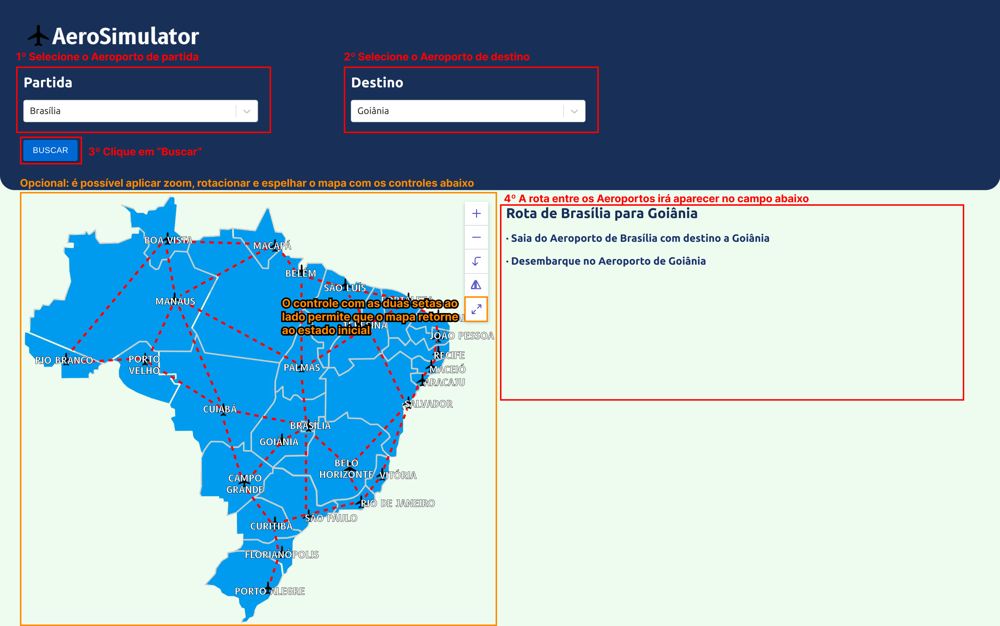

# AeroSimulator

**Conteúdo da Disciplina**: **Grafos 1**<br>

## Alunos

|Matrícula | Aluno |
| -- | -- |
| 19/0105267  |  Diógenes Dantas Lélis Júnior |
| 20/0018167  |  Gabriel Mariano da Silva |

## Sobre

O presente trabalho visa calcular a melhor rota entre os aeroportos dados os pontos de partida e chegada, oferecendo informações sobre as conexões necessárias.

O trabalho do algoritmo para a construção das rotas foi baseado no conceito de Busca em Largura de Grafos, visando a obtenção do menor caminho (i.e. o caminho com o menor número de "conexões" em outros aeroportos) entre os vértices desse grafo (aeroportos) através das arestas (conexões entre aeroportos) do grafo.

## Screenshots

### Exemplo de uso


### Exemplo de uso


### Exemplo de erro


### Exemplo de erro


## Instalação

**Linguagem**: *JavaScript*<br>
**Framework**: *React*<br>

## Como rodar o projeto?

Primeiramente, clone o repositório em sua máquina:

```
git clone git@github.com:projeto-de-algoritmos/Grafos1_AeroSimulator.git
```

Após isso, entre na pasta do projeto e consecutivamente entre na pasta *aerosimulator*, onde o projeto está localizado:

```
cd Grafos1_AeroSimulator/aerosimulator/
```

Em seguida, instale todas as dependências do projeto com o [**NPM**](https://docs.npmjs.com/downloading-and-installing-node-js-and-npm) (ou [**Yarn**](https://classic.yarnpkg.com/lang/en/docs/install/#debian-stable), caso prefira):

```
npm install
```

Por fim, para rodar o projeto, basta executar o *script* de *start*:

```
npm run start
```

O projeto será automaticamente executado e estará disponível em uma porta de sua máquina (geralmente a porta [3000](<http://localhost:3000>)).

## Uso

Para calcular a rota com menor conexões entre o aeroporto de partida e o aeroporto de destino, primeiramente selecione os pontos de partida e destino dentre as opções existentes.

Mas vale ressaltar que, para que a plataforma gere um resultado válido, os pontos de partida e destino devem estar ambos preenchidos (i.e. não podem estar nulos) e devem possuir opções diferentes (haja vista que não é lógico no contexto da aplicação que um avião saia de um aeroporto com destino imediato ao mesmo aeroporto).

Após preencher os campos de seleção de valores com os pontos de partida e destino, basta clicar no botão "Buscar" para que a rota apareça no campo de texto abaixo.

### Instruções de Uso

Abaixo, uma imagem explicativa quanto ao uso da aplicação:



## Apresentação

Caso queira assistir a apresentação realizada pela dupla a respeito do projeto, basta baixar o vídeo presente [**AQUI**](https://unbbr-my.sharepoint.com/:v:/g/personal/200018167_aluno_unb_br/EcuNwMCNoYdBsEhezcqV5rYBLTBT3PcDozvcc8U6C0YzZg?e=uzgkhs).

## Outros

### Conceito de "Melhor Rota"

No projeto, haja vista que o algoritmo de busca usado é o de **Busca em Largura (BFS)**, o resultado gerado na busca da rota entre dois aeroportos é a rota "mais curta", i.e., a rota com o menor número de nós entre os nós de partida e destino.

Destarte, o conceito de *"melhor rota"* não necessariamente implica, no contexto de nossa aplicação, na rota de menor distância física entre os dois aeroportos. No contexto da aplicação, o conceito de *"melhor rota"* implica na rota com menos conexões entre os aeroportos.

### Possíveis evoluções

O atual projeto possui diversas áreas passíveis de evolução, sejam elas relacionadas à lógica ou até mesmo ao *layout* e responsividade.

Uma possível evolução é o cálculo do tamanho da rota gerada levando em consideração a distância física entre os aeroportos. Neste rumo, também é possível melhorar a lógica de busca de rotas de tal forma que esta gere sempre a rota mais curta entre os aeroportos de partida e destino. Ainda neste escopo, outra possível evolução é a possibilidade de escolha da aeronave e, de acordo com sua capacidade máxima de locomoção (i.e., o seu *range*), o sistema retornaria a rota apenas com conexões estritamente necessárias, "saltando" aquelas em que o avião não precisasse pousar para reabastecer.

Quanto ao *layout*, existem diversas possibilidades de modificação, seja na área de **UX**, seja na parte de **Interação Humano Computador** para tornar o *design* mais "amigável" ao usuário, ou seja na responsividade da página em diferentes dispositivos onde a página seria exibida.

### Possível solução de erros nas dependências

Caso a aplicação, ao ser executada em máquina local, apresente algum erro relacionado ao uso de dependências, é possível que estas não tenham sido instaladas em sua máquina.

Para tal, garanta que foi executado o comando *npm install* (conforme explicado anteriormente).

Caso já tenha sido executado o comando e, mesmo com as dependências instaladas, ainda sejam exibidos erros quanto à estas, uma possível solução não usual (mas ainda assim possível) é a deleção por completo da pasta *node_modules* que está localizada em *Grafos1_AeroSimulator/aerosimulator/node_modules*. Após a deleção, faz-se necessário executar novamente o comando *npm install* para reinstalar as dependências. Mas tome cuidado! Essa é uma solução não usual e a deleção ser **exclusivamente** da pasta **node_modules**.
